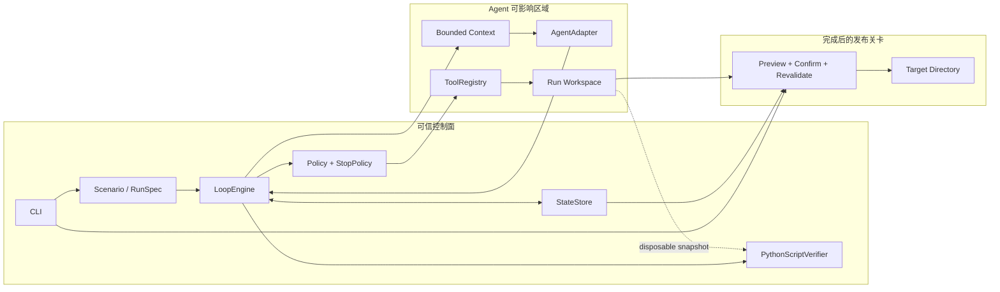
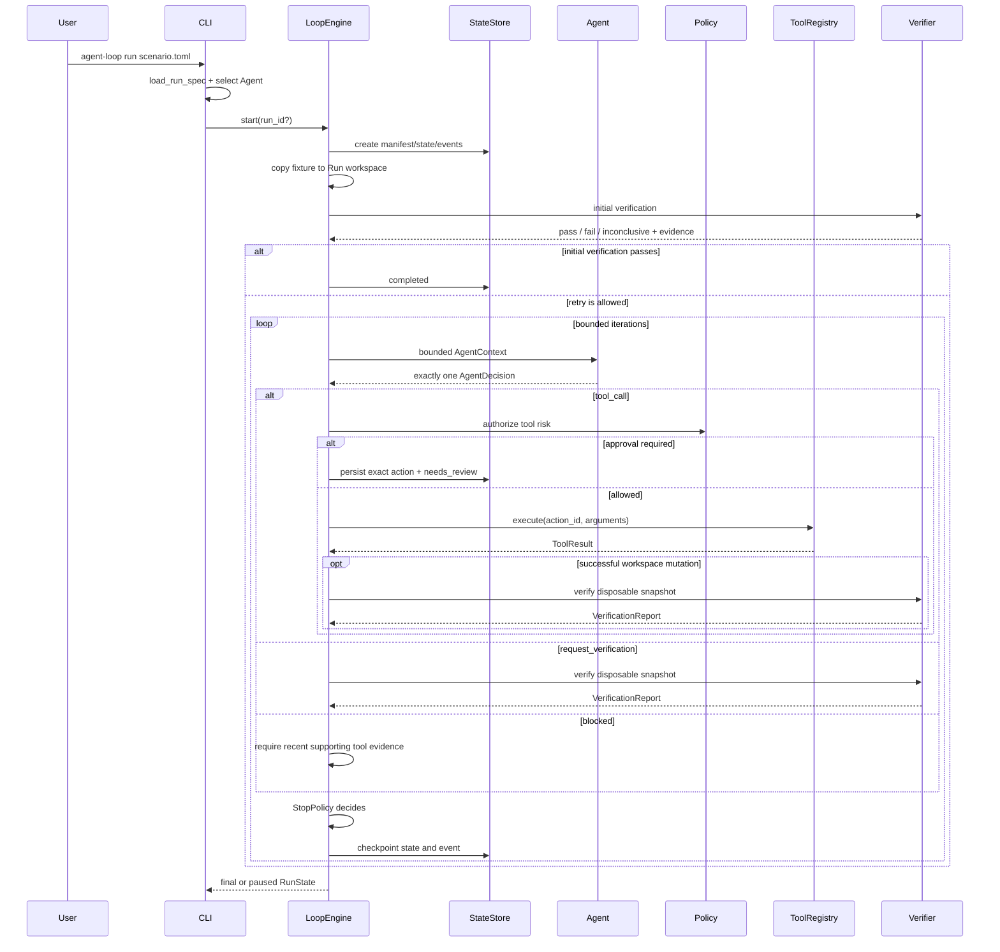
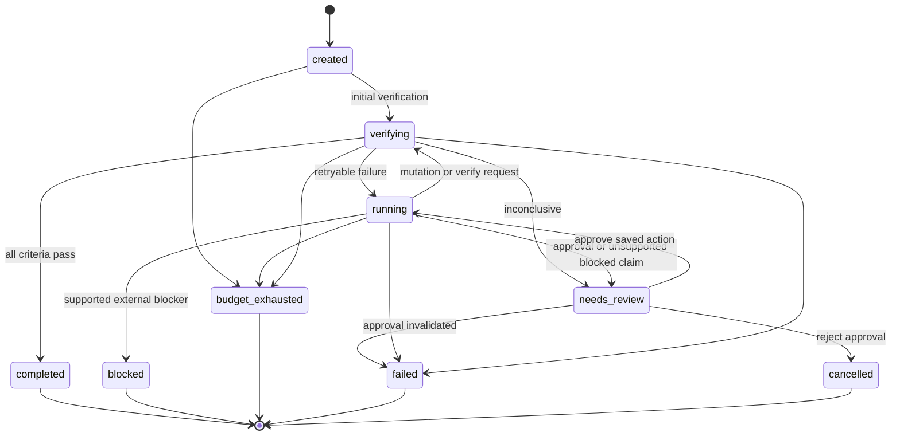

# Agent Loop 实现架构

> 本文描述当前 v0 代码实际如何工作，是阅读实现、增加 Scenario 和开展方案穿刺的入口。
> 设计动机、早期取舍和完整需求见 [DESIGN.md](DESIGN.md)。

## 1. 先建立一个心智模型

Agent Loop 不是让模型控制一个 `while` 循环，而是由外部控制器持有生命周期：

```text
Scenario 定义目标、成功标准和边界
                  ↓
LoopEngine 选择何时调用 Agent、Tool 和 Verifier
                  ↓
Agent 每轮只能提出一个结构化动作
                  ↓
Policy 授权后，Tool 才能在隔离工作区执行
                  ↓
独立 Verifier 产生证据，StopPolicy 决定继续或停止
                  ↓
StateStore 持久化当前快照和事件摘要，用户最后显式 apply
```

最重要的不变量是：**Agent 不能宣布任务完成；只有 Verifier 对全部验收标准给出 `pass`，`LoopEngine` 才能把 Run 置为 `completed`。**

项目刻意采用单进程、单 Agent、同步执行和本地文件状态。它不是生产级 Agent 平台，而是一个可以观察、修改和比较控制循环设计的实验基线。

## 2. 系统边界

系统有三条彼此分离的路径：

1. `run`：从 Scenario 创建隔离工作区并驱动闭环；
2. `resume`：从持久状态恢复暂停的审批动作；
3. `apply`：在 Run 完成后，由用户把已验证文件显式写入目标目录。

`apply` 不属于 Agent Loop 内部的工具，也不改变 Run 的终态。这个分离避免 Agent 通过普通工具把未验证内容直接发布到真实目录。



## 3. Loop Engineering 组件落点

| 必要组件 | 当前实现 | 主要入口 |
|---|---|---|
| Trigger | `run/resume/inspect/apply` CLI | `cli.py` |
| Goal / Success Criteria | 版本化 TOML Scenario | `config.py`, `RunSpec` |
| Skills / Context | Markdown 指令、最近证据、剩余预算和工具定义 | `context.py` |
| Isolation | 每个 Run 独立复制的工作区和路径约束 | `workspace.py` |
| Agent | 可复现脚本 Agent、可选 OpenAI Adapter | `agent.py`, `openai_agent.py` |
| Tools | 显式注册、严格参数、有限输出的工具 | `tools.py` |
| Authorization | 风险分级、默认拒绝和精确动作审批 | `policy.py`, `engine.py` |
| Verifier | 在一次性快照上运行的可信 Python 检查器 | `verifier.py` |
| Feedback | 最近 ToolResult 与 VerificationReport 进入下一轮 | `context.py`, `engine.py` |
| Durable State | 原子状态快照、追加事件和 artifacts | `storage.py` |
| Budget / Stop | 迭代、调用、验证、耗时和重复失败上限 | `policy.py` |
| Human Gate | 高风险动作审批，以及 completed 后显式 apply | `engine.py`, `application.py` |
| Trace / Audit | Console Trace、manifest、事件、证据和 apply 记录 | `cli.py`, `storage.py` |

Sub-agent、任务发现、队列、容器和真实业务 Connector 不属于 v0。它们是后续实验变量，不是理解当前闭环的前置条件。

## 4. 代码结构与依赖方向

```text
src/agent_loop/
├── cli.py            # 组合根；解析命令并组装一次运行
├── config.py         # TOML → 不可变 RunSpec，校验路径并计算摘要
├── types.py          # 跨组件共享的 Enum、dataclass 和错误类型
├── engine.py         # 正常驱动路径的状态迁移控制器和主循环
├── context.py        # 构造有界 AgentContext
├── agent.py          # AgentAdapter Protocol 和 ScriptedAgent
├── openai_agent.py   # 可选 Responses API Adapter
├── tools.py          # Tool Protocol、注册表、参数校验和执行结果
├── policy.py         # 动作授权、预算和停止决定
├── workspace.py      # Run 工作区、只读约束和路径隔离
├── verifier.py       # 快照验证、协议校验和证据保存
├── storage.py        # manifest/state/events/artifacts 持久化与恢复
└── application.py    # completed 后独立的安全发布流程
```

依赖方向遵循以下原则：

- `types.py` 是稳定数据契约，不依赖其他业务模块；
- `cli.py` 是组合根，选择 Agent 并创建 `StateStore`、`LoopEngine`；
- `engine.py` 编排组件，但不包含具体场景规则或模型提示；
- Agent 只通过 `AgentAdapter.next_action()` 进入控制面；
- Tool、Verifier 和 StateStore 之间通过可序列化数据交换，不共享模型会话；
- `application.py` 只读取已完成 Run，不被 `LoopEngine` 调用。

当前 v0 只有 `AgentAdapter` 和 `Tool` 被正式定义为 `Protocol`。Verifier、ContextBuilder 和 Workspace 仍由 `LoopEngine` 直接构造；如果实验需要替换它们，应先增加构造注入或工厂，而不是在主循环中增加 Provider 判断。

## 5. 一次 `run` 如何执行

入口是 `cli.main()`，核心路径如下：



关键执行顺序：

1. `load_run_spec()` 校验 Scenario，并把目录内稳定文件一起计算 SHA-256；
2. `StateStore.create()` 先保存 manifest、初始 state 和 `run_started`；
3. `Workspace.create()` 把 fixture 复制到 Run 私有目录；
4. 第一次调用 Agent 前必做初始验证，已满足目标时直接完成；
5. 每轮先消费迭代和 Agent 调用预算，再构造 Context；
6. Agent 输出必须通过 `AgentDecision.from_mapping()` 严格校验；
7. 工具必须同时存在于注册表和 Scenario allowlist，并经过 Policy；
8. 副作用前保存 `in_flight_action`，执行后保存 ToolResult 并清除；
9. 成功的工作区写动作后自动验证，读动作后不重复验证；
10. 每次验证后由 StopPolicy 根据证据、预算和重复失败决定下一状态。

模型超时、拒绝、非法 JSON 或非法决策都会变成受控的 Agent 错误记录，并继续受外层预算约束。它们不会绕过 Policy 执行工具。

## 6. Context、动作与反馈协议

`ContextBuilder` 每轮重建 Context，不维护无限增长的聊天记录。固定部分优先包含：

- 不可覆盖的行为规则；
- goal 和全部 acceptance criteria；
- 最近一次 ToolResult 与 VerificationReport；
- 剩余预算；
- 当前允许工具的参数 Schema；
- Scenario 引用的 Markdown Skill。

当字符数超过 `max_input_chars` 时，只截断 Skill 尾部，优先保留规则和最近证据。工作区文件被明确视作不可信数据，Agent 必须通过读取工具主动获取。

Agent 每轮只能返回以下一种决策：

| `kind` | 含义 | 控制面行为 |
|---|---|---|
| `tool_call` | 请求执行一个注册工具 | 校验 → Policy → 预算 → 执行 |
| `request_verification` | 请求检查当前结果 | 直接运行 Verifier，不能自行完成 |
| `blocked` | 声明缺少外部条件 | 仅有新近工具错误支持时进入 `blocked`，否则暂停复核 |

`ScriptedAgent` 从 JSON 顺序读取动作，保证教程和 CI 可复现；`OpenAIResponsesAgent` 使用严格 JSON Schema、显式模型、超时、输出上限、禁用 SDK 重试和 `store=False`。Provider 重试属于外层 Loop，必须被预算和事件记录看见。

## 7. 验证与成功判定

`PythonScriptVerifier` 把当前工作区复制到一次性快照，再以裁剪后的环境运行 Scenario 控制区中的固定脚本。模型不能修改验证脚本或参数；子进程不继承大多数环境变量，但可信脚本仍以宿主用户身份运行并可访问宿主文件或网络。

Verifier stdout 必须是一个 JSON 对象：

```json
{
  "schema_version": 1,
  "results": [
    {
      "criterion_id": "implementation-matches",
      "verdict": "pass",
      "message": "implementation.txt 内容正确",
      "evidence": []
    }
  ]
}
```

约束如下：

- criterion ID 集合必须与 Scenario 完全一致，不能缺失、重复或增加；
- `pass/fail/inconclusive` 分别对应退出码 `0/1/2`；
- 退出码冲突、超时、非法 JSON 或协议错误统一视为 `inconclusive`；
- stdout、stderr 和退出码保存在 `artifacts/verification/`；
- 任一标准未通过就不能进入 `completed`；
- 相同失败指纹且工作区摘要不变，达到上限后进入 `failed`。

Verifier 属于可信控制面代码。复制快照能隔离验证产生的文件，但不是用来安全运行恶意验证脚本的 OS Sandbox。

## 8. 状态机与停止语义



状态语义：

| 状态 | 是否终态 | 含义 |
|---|---:|---|
| `created` | 否 | Run 已持久化，尚未完成初始验证 |
| `running` | 否 | 可以进入下一轮 Agent 调用 |
| `verifying` | 否 | 正在建立外部完成证据 |
| `needs_review` | 否 | 自动循环暂停，需要人工判断或审批 |
| `completed` | 是 | 全部验收标准有通过证据 |
| `blocked` | 是 | 工具证据支持存在外部阻塞 |
| `budget_exhausted` | 是 | 任一硬预算耗尽 |
| `failed` | 是 | 非重试错误、重复失败或一致性问题 |
| `cancelled` | 是 | 人工拒绝审批 |

硬预算包括迭代数、Agent 调用数、工具调用数、验证次数和单次运行耗时。相同失败达到 `max_same_failure` 是进入 `failed` 的独立停止规则；两类上限都不会偷偷增加重试。

## 9. 持久化与崩溃恢复

每个 Run 的目录是一个可独立检查的事实包；`applications/` 只在 apply 成功生成预览后出现：

```text
.agent-loop/runs/<run-id>/
├── manifest.json       # 冻结的 Scenario、摘要和 Agent/model
├── state.json          # 恢复事实源；当前 RunState
├── events.jsonl        # 只追加的教学与审计时间线
├── workspace/          # Agent 可变的隔离工作区
├── artifacts/          # Verifier stdout/stderr/exit code
└── applications/       # 可选；预览后的确认与应用审计记录
```

`checkpoint()` 的提交顺序是：先原子替换 `state.json`，再追加并 `fsync` 事件。因此崩溃时允许 state 比事件领先，但不应让事件描述一个尚未提交的 state。

`recover()` 采用保守语义：

- 事件尾部只有一行不完整 JSON：截断该尾部并记录恢复事件；
- state revision 领先：以 state 为准并补记恢复事件；
- 事件领先、日志中段损坏：进入 `needs_review`；
- 存在 `in_flight_action`：动作结果未知，进入 `needs_review`，绝不盲目重放；
- Scenario 摘要或 Agent/model 与原 Run 不同：拒绝 resume。

审批请求保存完整决策、`action_id` 和当时的 workspace digest。批准时只执行该保存动作，不重新询问 Agent；工作区变化会使批准失效。

当前 CLI 只会解除带 `pending_approval` 的审批暂停。Verifier `inconclusive`、事件损坏或未知副作用也会进入 `needs_review`，但 v0 没有通用的 reconcile/retry/cancel 命令；这类 Run 需要人工检查后创建新 Run，不能用 `--approve` 绕过。

v0 不保证任意 checkpoint 的确定性重放：Agent 调用已计数但工具尚未启动时中断，ScriptedAgent 恢复可能跳过动作；Verifier 已进入 `verifying` 但报告未落盘时中断，恢复可能触发非法状态迁移。这些 Run 应人工检查后创建新 Run。

## 10. `apply` 发布关卡

Run 中的工具始终只修改隔离工作区。`agent-loop apply` 才能把结果写入用户指定目录。它比较最终 workspace 中的全部文件与目标目录，而不是只计算 Agent 相对 fixture 的改动：

```text
load completed Run
  → require last verifier verdict=pass
  → scan verified workspace without following symlinks
  → compare target and build preview
  → persist prepared application record
  → explicit confirmation
  → re-scan workspace and compared target paths
  → atomically replace changed files
  → persist applied/declined/failed record
```

当前边界：

- 只传播新增和修改，不传播删除；
- 最多 1000 个文件、总计 10 MB；
- 目标目录必须已存在，且不能位于 Run 目录内；
- 确认前后 workspace、目标根目录身份或待覆盖目标文件内容变化会拒绝执行；无关目标文件不参与复核；
- 路径逐段以目录文件描述符打开并拒绝符号链接；
- 只复制文件内容，不保留权限或可执行位；写入文件以 `0600` 创建（仍受 umask 约束）；
- 依赖 POSIX `O_NOFOLLOW` 和 `O_DIRECTORY`，支持 macOS/Linux；
- 多文件发布不是跨文件事务，失败记录会包含已经应用的路径。

## 11. Scenario 是最小实验单元

一个 Scenario 通常包含：

```text
scenarios/<name>/
├── scenario.toml          # goal、criteria、边界、预算和组件选择
├── skill.md               # 交给 Agent 的领域/项目说明
├── fixture/               # 每次 Run 的工作区种子
├── checks/verify.py       # Agent 不可写的可信验收逻辑
└── scripted_actions.json  # 可选的确定性 Agent 动作
```

新增 Scenario 的推荐顺序：

1. 先写唯一且可执行检查的 `acceptance_criteria`；
2. 在 `checks/verify.py` 中为每个 ID 输出一个结果；
3. 准备最小 fixture，并用 `workspace.read_only` 保护任务材料；
4. 只开放任务所需工具，给所有路径、输出和运行时间设上限；
5. 写 Happy Path，再补 Feedback、Budget 或 Approval Path；
6. 使用 ScriptedAgent 固定基线，再替换一个组件做实验。

Scenario 目录不能包含符号链接。目录内稳定文件都会进入 digest，因此修改 Skill、验证器或脚本动作后，旧 Run 会拒绝按新定义恢复。

## 12. 如何扩展而不破坏闭环

先区分当前已有的注入点和设计上的目标扩展缝：

| 组件 | 当前替换方式 | 是否无需修改 Engine |
|---|---|---:|
| Agent | 构造 `LoopEngine` 时传入 `AgentAdapter` | 是 |
| StateStore | 构造时传入兼容 `StateStore` 完整表面的对象 | 是，但尚无正式 Protocol |
| Clock | 构造时注入单调时钟，主要用于测试 | 是 |
| Scenario / Skill / 检查脚本 | 新建 Scenario 文件 | 是 |
| Tool | 修改 metadata、Registry 和配置 allowlist | 否 |
| ContextBuilder / Verifier / Workspace | 先给 Engine 增加工厂或构造注入 | 否 |
| Policy / StopPolicy | 先调整 Engine 构造器 | 否 |

“一次替换一个接口”是项目演进原则，不代表所有组件已经是动态插件。方案穿刺前应先确认上表，避免把接缝目标误当成现有能力。

### 增加 Agent Adapter

实现 `name` 和 `next_action(context) -> AgentDecision`，即可在 Python 中直接组装 `LoopEngine`。若要从现有 CLI/TOML 选择，还需扩充 `cli.py` 和 `config.py` 中封闭的 Agent 类型列表。Adapter 应负责 Provider 请求与响应转换，但不能执行工具、设置状态或自行重试。需要恢复确定性游标时可提供 `restore(completed_calls)`；可选的 `model` 和 `last_usage` 会进入 manifest 或事件。

### 增加 Tool

需要同步完成四件事：

1. 实现 `Tool` 的 `name/risk/mutates_workspace/run`；
2. 在 `TOOL_METADATA` 声明给 Agent 看的严格参数 Schema；
3. 在 `ToolRegistry` 注册，并在配置加载器的已知工具集合中登记；
4. 为参数拒绝、路径边界、输出截断、Policy 和恢复语义增加测试。

参数 Schema 当前不会作为统一运行时校验器调用，`run()` 仍必须自行拒绝缺失、未知和错误类型参数。真实外部副作用还必须支持幂等键或人工对账。否则崩溃后的 `in_flight_action` 无法安全恢复。

### 替换 Verifier、Context、Workspace 或 Policy

这些组件在 v0 中仍由 Engine 直接构造。第一次方案穿刺应先提取最小 Protocol/Factory，再替换实现，并保持 `RunSpec`、`AgentDecision`、`ToolResult`、`VerificationReport`、`RunState` 和 `LoopEvent` 的语义不变。

### 替换 StateStore

StateStore 已经通过构造器传入，但尚无正式 Protocol。替代实现必须兼容 Engine、CLI inspect 和 apply 使用的完整方法表面，并保持 state 先提交、event 后追加、revision/sequence 单调以及未知 in-flight 不重放等语义。

推荐一次只替换一个变量，并复用相同 Scenario、预算和 ScriptedAgent 基线。对比至少记录最终状态、迭代/调用次数、验证失败数、耗时和模型用量。

## 13. 测试地图

| 关注点 | 测试文件 |
|---|---|
| 完整闭环、证据完成、预算和重复失败 | `tests/test_engine.py` |
| Scenario 校验、摘要、路径与 Run 隔离 | `tests/test_config_workspace.py` |
| Context 保留证据、脚本 Agent 可复现 | `tests/test_context_agent.py` |
| 工具参数/输出、风险授权与停止策略 | `tests/test_tools_policy.py` |
| Verifier 协议、快照隔离和 inconclusive | `tests/test_verifier.py` |
| 状态快照、事件顺序和崩溃恢复 | `tests/test_storage.py` |
| 精确审批、拒绝和恢复约束 | `tests/test_resume.py` |
| Apply 确认、摘要复核和符号链接防护 | `tests/test_application.py` |
| OpenAI 严格输出、拒绝和不完整响应 | `tests/test_openai_agent.py` |
| CLI 的四个入口和教学路径 | `tests/test_cli.py` |

本地验证：

```bash
PYTHONPATH=src python -m unittest discover -s tests -v
python -m compileall -q src tests scenarios
```

## 14. 推荐阅读代码的顺序

如果只有 20 分钟，按以下顺序阅读：

1. `scenarios/hello-loop/scenario.toml`：理解一个任务如何定义；
2. `src/agent_loop/types.py`：认识跨组件数据契约；
3. `src/agent_loop/engine.py` 的 `start()`、`resume()` 和 `_drive()`：看外层循环；
4. `src/agent_loop/verifier.py` 与 `policy.py`：看完成证据和停止权归属；
5. `src/agent_loop/storage.py`：看对话之外的状态如何持久化；
6. `src/agent_loop/application.py`：看验证结果如何离开隔离区；
7. 对照 `tests/test_engine.py` 跑一次 Feedback Path。

## 15. 信任边界与已知限制

信任模型：

- 不可信输入包括模型输出和 Agent workspace 文件；
- Scenario、Skill、AgentAdapter、工具实现、Verifier 脚本及运行本程序的本地用户属于可信控制面；
- 自定义 AgentAdapter 和 Tool 与 Loop 同进程运行，拥有宿主进程权限，不受 Workspace/Policy 沙箱约束；
- Verifier 虽使用快照和裁剪环境，仍是普通 Python 子进程，可以访问宿主文件或网络，因此只能使用可信脚本；
- OpenAI Adapter 会把构造后的 Context 发往指定 Provider；默认 ScriptedAgent 完全离线；
- Run 文件以明文保存在本地，没有签名或内建访问控制；state/artifacts 可能含文件内容和最近结果。不要让 Agent 读取密钥文件，也不要把密钥放入 prompt、动作参数或摘要。

已知限制：

- 复制目录只提供教学级文件隔离，不是强安全 OS 沙箱；
- 默认工具集没有任意 Shell、业务网络工具、真实外部写入或自动部署；LLM Provider 请求除外；
- 没有多 Agent、调度队列、并发工作流或跨机器恢复；
- `StateStore` 没有文件锁，同一 Run 不应被多个进程并发恢复或写入；事件也不是防篡改账本；
- 每次 `start/resume` 都重新获得完整 elapsed deadline；它不是跨多次恢复累计的墙钟预算；
- Provider 返回的 Token usage 会进入事件，但费用不计算；Token 也不参与累计停止，自定义 Tool 没有统一超时；
- Context 当前只保留最近一次工具和验证结果；`max_history_items` 尚未使用，也不实现历史摘要或 RAG；
- `max_input_chars` 只截断 Skill，固定规则块自身过大时仍可能超过上限；source digest 尚未写入事件；
- 内置 `read_file` 会截断大输出，但没有通用 artifact spill，新增 Tool 必须自行限制输出；
- `needs_review` 只有审批暂停具备 CLI 恢复路径；
- Agent 调用或 Verifier 执行中的部分崩溃窗口没有可靠的自动重放路径；
- `apply` 不处理删除，且多文件写入不是全局原子事务；
- 当前扩展机制是源码级注册，不是动态插件系统。

这些限制是有意保留的实验接缝。判断新设计是否值得进入基线时，优先看它是否增强可验证性、可恢复性或隔离性，而不是只增加 Agent 的自主程度。
