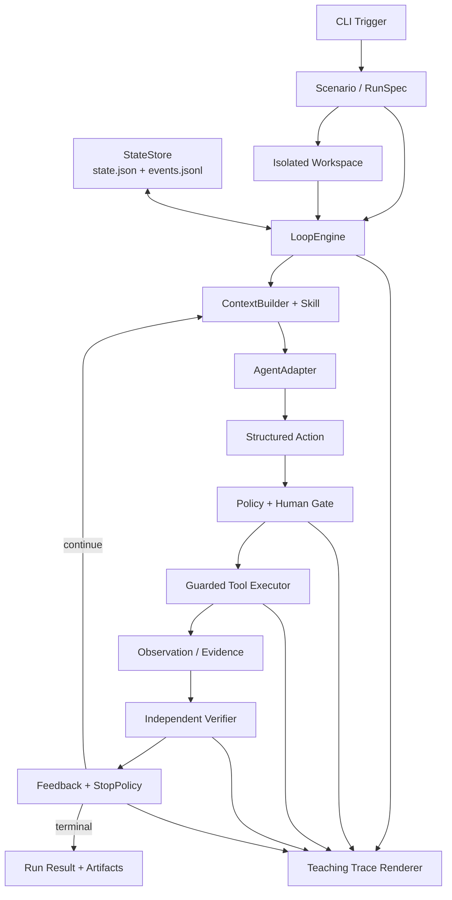
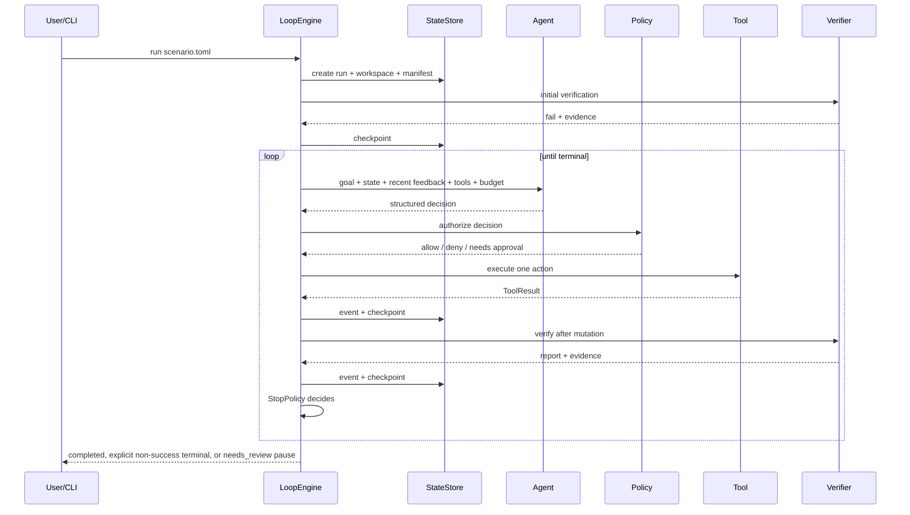
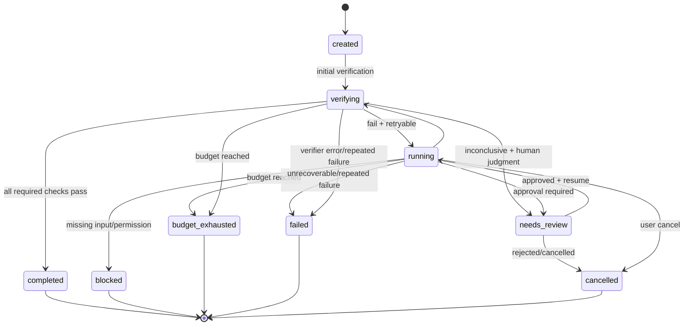

# 教学型 Agent Loop：最小完整实现设计

> 状态：Draft
> 版本：0.1
> 目标读者：实现者、教学内容设计者、后续方案穿刺参与者

## 1. 摘要

本项目实现一个用于讲解和实验 Agent Loop 的最小系统。它不是一个通用 Agent 平台，而是一套刻意保持透明、可运行、可验证、可替换的参考实现。

系统采用 Loop Engineering 的外层控制思想：人定义目标、成功标准和边界；Loop Engine 负责反复调用 Agent、执行受控动作、独立验证结果、保存状态，并根据证据、预算和安全策略决定继续或停止。

v0 的实现选择是：

- 单进程、单任务、单 Agent、同步执行；
- CLI 手工触发；
- 临时目录隔离；
- 本地 Markdown/TOML 上下文与 Skill；
- 三个文件工具，不开放任意 Shell；
- 确定性 Verifier，不使用 Agent 自评作为完成依据；
- `state.json + events.jsonl` 持久化；
- 明确预算、终态、权限策略和人工关卡；
- Console Trace 展示每次循环的输入、动作、证据和停止原因；
- 同时提供可复现的 `ScriptedAgent` 和一个真实模型适配器。

最小化的对象是基础设施规模，而不是闭环语义。目标、上下文、执行、验证、反馈、状态、预算、停止、安全和审计均不可省略。

## 2. 背景与问题

普通的 Agent 示例经常被简化为：

```python
while not done:
    response = model(messages, tools)
    execute(response.tool_call)
```

这种示例能展示工具调用，却没有回答生产系统中更关键的问题：

- 谁定义完成，Agent 是否能自己宣布成功？
- 失败证据如何进入下一轮？
- 进程中断后从哪里继续？
- 最多允许循环多久、花费多少资源？
- Agent 可以修改什么，哪些动作必须人工批准？
- 如何解释某一轮为何继续、为何停止？
- 怎样替换模型、上下文、验证器或沙箱而不重写主循环？

本项目用尽可能少的代码完整回答这些问题，并将每个控制阶段显式呈现给学习者。

## 3. 目标与非目标

### 3.1 产品目标

1. **教学清晰**：学习者能观察一次完整的 Trigger → Act → Verify → Feedback → Stop 循环。
2. **闭环正确**：只有独立验证通过，系统才能进入 `completed`。
3. **安全可控**：Agent 的所有副作用都经过工具、策略和隔离工作区。
4. **可恢复**：每轮状态持久化，进程中断后可检查并恢复。
5. **方便穿刺**：模型、上下文、工具、验证、状态、策略、沙箱和展示层可以独立替换。
6. **可比较**：每次运行留下稳定的 manifest、事件和指标，支持比较不同实验方案。

### 3.2 v0 非目标

v0 明确不建设：

- 多 Agent 并发或角色树；
- 自动任务发现、Cron、Webhook 和分布式队列；
- Web UI 和远程控制面；
- GitHub、Jira、Slack 等真实外部连接器；
- 动态插件发现、依赖解析和插件市场；
- 任意 Shell、网络访问、生产凭据或生产部署；
- Git worktree、容器或远程沙箱；
- 向量数据库、RAG 和跨项目长期记忆；
- 通用工作流 DSL；
- 自动合并、发布或把结果写回真实项目；
- 用多个 LLM 相互投票来代替确定性验证。

这些能力不是闭环成立的前提。v0 只保留足够小的接口，使其以后可以作为替换实现接入。

## 4. 核心概念

| 概念 | 本文含义 |
|---|---|
| Scenario | 可重复运行的教学或实验场景，包含目标、材料、Skill、验证和预算 |
| Run | Scenario 的一次具体执行，具有唯一 `run_id` |
| Iteration | Agent 获取上下文并提出一个动作的一轮 |
| Action | Agent 提出的一个结构化工具调用、验证请求或阻塞声明 |
| Evidence | 工具或 Verifier 产生的可审计事实，不是 Agent 的自述 |
| Verification | 独立于执行 Agent 的成功标准检查 |
| Feedback | 由验证证据生成、交给下一轮 Agent 的信息 |
| Terminal State | Loop 不再自动继续的明确状态 |
| Spike | 只替换一个或少数组件以快速验证设计假设的实验 |

## 5. 设计原则与系统不变量

以下约束优先于实现便利性：

1. 只有 `LoopEngine` 能改变 Run 生命周期状态。
2. Run 内所有由 Agent 发起的副作用只能通过注册过的 `Tool` 发生；用户在 Run 结束后显式执行的发布操作单独审计。
3. Agent 只能提出动作，不能直接执行动作，也不能设置 `completed`。
4. `completed` 必须来自 Verifier 对全部必需标准的通过证据。
5. Verifier 的定义、Scenario 规范、安全策略和运行状态对 Agent 只读。
6. 每个动作执行前必须经过 Policy；高风险动作必须经过 Human Gate。
7. 每个 Run 使用独立工作区，工具路径不得逃逸工作区。
8. 每次副作用、验证和状态迁移都产生结构化事件并及时落盘。
9. 所有循环路径都受预算和停止策略约束，不存在无上限重试。
10. 终态默认不可逆；`needs_review` 是可恢复的暂停态，不是成功或终态。
11. Context 有明确大小上限，不把无限增长的完整历史反复发送给模型。
12. 日志只保存决策摘要，不要求或存储模型的隐式思维链。

## 6. 总体架构



### 6.1 Loop Engineering 组件映射

| 必要能力 | v0 最小实现 | 后续替换方向 |
|---|---|---|
| Automation / Trigger | `agent-loop run` CLI | Cron、CI、Webhook、任务队列 |
| Goal / Success Criteria | 不可变 `scenario.toml` | Issue、远程任务规范、版本化 Spec |
| Context / Skills | 本地 Markdown + 最近状态/证据 | 摘要、检索、RAG、分层记忆 |
| Isolation | fixture 复制到独立 Run 目录 | Git worktree、容器、远程沙箱 |
| Agent | Scripted + 一个 LLM Adapter | 不同模型、Planner、Agent Team |
| Tools / Plugins | 手工注册三个文件工具 | Shell、MCP、GitHub、业务 Connector |
| Authorization | 风险等级 + 默认拒绝 | 组织权限服务、细粒度策略 |
| Verifier | 确定性规则或受控命令 | 测试矩阵、Reviewer Agent、真实指标 |
| Feedback / Retry | 验证反馈 + 重复失败指纹 | 自适应策略、故障分类器 |
| Durable State | JSON 快照 + JSONL 事件 | SQLite、对象存储、远程状态服务 |
| Budget / Stop | 次数、时间、调用数、重复失败 | Token、费用、组织配额 |
| Human Gate | CLI 审批和显式 `apply` | PR 审批、外部审批系统 |
| Observability | Console Trace + artifacts | Web UI、OpenTelemetry、实验面板 |

### 6.2 为什么 v0 不实现 Sub-agent

生成者和验证者必须职责分离，但不要求两者都是 LLM。v0 使用一个执行 Agent 和一个确定性 Verifier，已经避免“自己给自己打分”。

真正的 Explorer、Planner、Implementer、Reviewer 子 Agent 会显著增加消息协议、并发、状态归属和预算分摊复杂度，不利于展示最核心的外层循环。后续可以通过组合 `AgentAdapter` 或替换 `Verifier` 加入，而不修改 `LoopEngine`。

## 7. 技术选型

### 7.1 运行时

- Python 3.12+
- 同步执行模型
- 标准库优先：`argparse`、`dataclasses`、`typing.Protocol`、`pathlib`、`json`、`tomllib`、`subprocess`、`tempfile`、`shutil`、`hashlib`
- `ScriptedAgent` 零网络、零模型依赖
- 真实模型 SDK 作为 optional dependency，通过 `AgentAdapter` 隔离

### 7.2 配置格式

Scenario 使用 TOML，而不是在 v0 自建 DSL：

- Python 标准库可以直接读取；
- 对教学场景足够可读；
- 能表达列表和分组；
- 不允许在配置中表达任意控制流，避免演化成工作流引擎。

Agent 的动作、事件和状态使用 JSON，便于严格校验、回放和后续工具消费。

## 8. 最小目录结构

```text
agent-loop/
├── DESIGN.md
├── README.md
├── pyproject.toml
├── src/agent_loop/
│   ├── cli.py          # run/resume/inspect/apply 入口与 CLI Trigger
│   ├── types.py        # 稳定数据契约与 Protocol
│   ├── engine.py       # 唯一主循环和生命周期控制器
│   ├── agent.py        # ScriptedAgent 与真实模型适配器
│   ├── context.py      # Context/Skill 构造和长度控制
│   ├── tools.py        # ToolRegistry、参数校验、文件工具
│   ├── verifier.py     # 确定性验证和 VerificationReport
│   ├── policy.py       # 权限、审批、预算、StopPolicy
│   ├── workspace.py    # 隔离目录、路径约束、变更清单
│   └── storage.py      # state、events、manifest、artifacts、Trace
├── scenarios/
│   ├── hello-loop/
│   │   ├── scenario.toml
│   │   ├── skill.md
│   │   ├── fixture/
│   │   └── checks/
│   └── approval-loop/
│       └── ...
└── tests/
    ├── test_happy_path.py
    ├── test_feedback_path.py
    ├── test_budget_path.py
    ├── test_gate.py
    ├── test_resume.py
    └── test_workspace_escape.py
```

概念边界需要稳定，但 v0 不为每个接口创建独立包。核心循环应保持在一到两屏代码内。

## 9. Scenario / RunSpec

Scenario 是 Loop 的不可变输入。一次 Run 启动后，系统保存规范内容及其 SHA-256；Agent 无权修改原始规范。

最小示例：

```toml
schema_version = 1
scenario_id = "hello-loop"
title = "通过验证反馈修正实现"
learning_objective = "观察 Agent 执行、验证失败、吸收反馈并再次执行的闭环"
goal = "修改 implementation.txt，使其满足 requirements.txt 中的全部要求"
acceptance_criteria = [
  "requirements-file-unchanged",
  "implementation-passes-all-checks",
]

instructions = ["skill.md"]
allowed_tools = ["list_files", "read_file", "write_file"]

[context]
max_input_chars = 30000
max_history_items = 8
max_tool_output_chars = 8000

[workspace]
mode = "copy"
seed = "fixture"
read_only = ["requirements.txt"]

[agent]
kind = "scripted" # 也可以由 CLI 覆盖为 llm
request_timeout_seconds = 30
max_output_tokens = 1000

[verification]
kind = "python_script"
script = "checks/verify.py"
timeout_seconds = 10

[budget]
max_iterations = 6
max_agent_calls = 6
max_tool_calls = 10
max_verifications = 7 # 包含一次初始验证和最多六次修改后验证
max_elapsed_seconds = 120
max_same_failure = 2

[policy]
auto_allow = ["read", "local_write"]
require_approval = ["export"]
deny = ["network", "external_write", "irreversible"]
```

实现加载时应将已知路径字段解析为 Scenario 根目录下的绝对路径。`verification.script` 始终从 Scenario 控制区加载，不复制到 Agent workspace；验证输入是工作区的只读快照。

### 9.1 成功标准

每个 Scenario 必须提供可执行 Verifier。自然语言 `goal` 用于指导 Agent，但不能单独作为成功标准。

验收结果采用三值语义：

- `pass`：存在足够证据证明标准满足；
- `fail`：存在明确失败证据，可以进入反馈或停止；
- `inconclusive`：验证器无法判断，不得当作成功。

## 10. 核心数据契约

具体实现可使用冻结的 `dataclass`、Enum 和 `Protocol`。以下是语义接口，不要求逐字照搬。

```python
class AgentAdapter(Protocol):
    def next_action(self, context: AgentContext) -> AgentDecision: ...

class Tool(Protocol):
    name: str
    risk: RiskLevel
    mutates_workspace: bool
    def execute(self, args: dict, ctx: ToolContext) -> ToolResult: ...

class Verifier(Protocol):
    def verify(self, ctx: VerificationContext) -> VerificationReport: ...

class StateStore(Protocol):
    def create(self, spec: RunSpec) -> RunState: ...
    def load(self, run_id: str) -> RunState: ...
    def checkpoint(self, state: RunState) -> None: ...
    def append_event(self, event: LoopEvent) -> None: ...

class ApprovalProvider(Protocol):
    def authorize(self, request: ApprovalRequest) -> ApprovalDecision: ...
```

首版需要稳定的七个公共数据类型：

```text
RunSpec
RunState
AgentDecision
ToolResult
VerificationReport
StopDecision
LoopEvent
```

### 10.1 AgentDecision

Agent 每轮只能返回一种严格结构化决策：

```json
{
  "kind": "tool_call",
  "summary": "根据上次验证反馈补充缺少的问候语",
  "tool": "write_file",
  "arguments": {
    "path": "implementation.txt",
    "content": "Hello, loop!\n"
  }
}
```

其他允许的类型：

```json
{"kind":"request_verification","summary":"当前结果应已满足要求"}
{"kind":"blocked","summary":"缺少完成任务所需的输入","reason":"..."}
```

要求：

- JSON Schema 校验失败时不执行任何工具；
- 未知工具或未知字段默认拒绝；
- `summary` 是简洁的可解释决策依据，不是隐式思维链；
- `request_verification` 只是请求检查，不能直接完成；
- `blocked` 只是 `BlockedProposal`；StopPolicy 必须结合最近工具证据判断为 `blocked`、`needs_review` 或继续；
- 模型超时、空输出、无效 JSON 都转换为受控失败并计入预算。

### 10.2 ToolResult

```text
action_id
tool_name
status: success | error | denied | needs_approval
summary
artifact_refs[]
error_code?
duration_ms
output_truncated
```

较大输出写入 `artifacts/`，事件和上下文只保存摘要与引用。

### 10.3 VerificationReport

```text
verdict: pass | fail | inconclusive
criteria_results[]
evidence_refs[]
feedback
failure_fingerprint?
retryable
duration_ms
```

`failure_fingerprint` 由稳定的失败类型、标准 ID 和规范化错误摘要计算，用于识别无进展的重复失败。

## 11. LoopEngine

`LoopEngine` 是唯一的生命周期编排者，不包含模型、工具、业务验证或展示逻辑。

### 11.1 主循环

```python
def run(run_id):
    state = store.load(run_id)

    if state.status == NEEDS_REVIEW:
        state = resolve_pending_review(state)
        if state.status == NEEDS_REVIEW or state.is_terminal:
            return

    if not state.initial_verification_done:
        report = verify_and_checkpoint(state)
        stop = stop_policy.after_verification(state, report)
        if stop:
            transition_and_checkpoint(state, stop)
            return
        transition_and_checkpoint(state, RUNNING)

    while not state.is_terminal:
        stop = stop_policy.before_iteration(state)
        if stop:
            transition_and_checkpoint(state, stop)
            break

        result = None
        begin_iteration_and_checkpoint(state)  # 先计数，再调用外部模型
        context = context_builder.build(state)
        decision = agent.next_action(context)
        record(decision)

        if decision.kind == "blocked":
            stop = stop_policy.on_blocked_proposal(state, decision)
            if stop == CONTINUE:
                checkpoint_blocked_feedback(state, decision)
                continue
            transition_and_checkpoint(state, stop)
            break

        if decision.kind == "tool_call":
            authorization = policy.authorize(decision, state)
            if authorization.needs_approval:
                pause_and_checkpoint(state, NEEDS_REVIEW, decision)
                return  # 等待对该 action_id 显式批准后 resume
            if authorization.denied:
                checkpoint_denial_as_feedback(state, authorization)
                continue
            checkpoint_in_flight(state, decision)  # 副作用前持久化 action_id
            record_tool_started(decision)
            result = tools.execute(decision, workspace)
            checkpoint_result_and_clear_in_flight(state, result)

        if should_verify(decision, result):
            report = verify_and_checkpoint(state)
            stop = stop_policy.after_verification(state, report)
            if stop:
                transition_and_checkpoint(state, stop)
                break
            transition_and_checkpoint(state, RUNNING)

        checkpoint_iteration(state)
```

`resolve_pending_review` 按暂停原因分派：动作审批通过时执行已保存的原 ToolCall，并在写动作后验证；Verifier `inconclusive` 时只能重试验证、修复验证环境或取消；恢复歧义需要人工确认事实。任何人工处理都不能绕过成功标准直接把 Run 标成 `completed`。

### 11.2 验证时机

v0 在以下时间验证：

1. Run 开始时先验证一次，已满足目标则幂等完成；
2. 每个会修改工作区的成功动作之后；
3. Agent 明确请求验证时；
4. 不在纯读取动作后重复运行 Verifier。

这样能清楚展示 Action → Verification → Feedback，同时避免无意义地反复执行检查。

### 11.3 每轮顺序约束

- `action_proposed` 必须先于授权和工具执行事件；
- Policy 必须在任何副作用之前运行；
- 授权通过后，必须先原子持久化 `in_flight_action` 并记录 `tool_started`，再执行副作用；
- ToolResult 落盘时才清除 `in_flight_action`；进程崩溃会留下可识别的未决动作；
- 工具完成后立即记录结果和预算，不等待下一轮；
- 每次验证后必须持久化报告；
- StopPolicy 只根据状态、预算和证据做决定；
- 验证失败的 `feedback` 必须进入下一轮 Context；
- 进入终态前写入明确的 `stop_reason`。

## 12. 运行时序



## 13. 状态模型与停止条件

### 13.1 状态机



`verifying` 可以是短暂但仍持久化的状态，便于崩溃检查和教学回放。

允许迁移以这张表为准；未列出的迁移一律拒绝：

| From | Allowed To |
|---|---|
| `created` | `verifying`, `failed`, `cancelled` |
| `verifying` | `running`, `completed`, `needs_review`, `budget_exhausted`, `failed`, `cancelled` |
| `running` | `verifying`, `needs_review`, `blocked`, `budget_exhausted`, `failed`, `cancelled` |
| `needs_review` | `running`, `cancelled`, `failed` |
| 任一终态 | 无 |

### 13.2 停止与暂停状态语义

| 状态 | 含义 |
|---|---|
| `completed` | 所有必需成功标准有通过证据 |
| `blocked` | 缺少输入、权限或外部条件，自动重试没有意义 |
| `needs_review` | 可恢复暂停态；需要主观判断或高风险动作审批，当前调用返回 |
| `budget_exhausted` | 达到步骤、时间、调用、Token 或费用边界 |
| `failed` | 在既定边界内发生不可恢复错误或重复失败 |
| `cancelled` | 用户主动终止或拒绝继续 |

### 13.3 最小预算

v0 必须限制：

- 最大 Iteration；
- 最大 Agent 调用数；
- 最大工具调用数；
- 最大验证次数；
- 最大运行时长；
- 最大相同失败次数。

真实 LLM Adapter 可额外上报 Token 和估算费用。缺少用量数据时显示 `unknown`，不得伪造为零。

预算在每轮开始前、工具调用前和验证后检查。执行预算不能占用为验证和最终状态落盘保留的资源。

计数规则固定如下：

- 初始验证计入 `max_verifications`，因此示例的上限是 `max_iterations + 1`；
- 每次准备 Context 并尝试调用 Agent，就先增加一次 `iteration` 和 `agent_calls`，即使请求超时或输出非法；
- 工具和验证在启动前分别增加 `tool_calls`、`verifications`，预算不足则不启动；
- 已启动的验证无论成功、失败或解析错误都必须先落盘，再执行 StopPolicy；
- 审批恢复后执行已保存的原动作，不创建新的 Iteration，也不再次调用 Agent；
- 每次 StopPolicy 判断都产生 `stop_decided` 事件；继续时也记录原因。

## 14. Context 与 Skills

每轮 Context 按固定优先级构造：

1. 不可覆盖的系统行为和安全策略；
2. Goal 与成功标准摘要；
3. Scenario 指定的 Skill/项目规则；
4. 当前 RunState 与剩余预算；
5. 最近一次 ToolResult；
6. 最近一次 VerificationReport 和反馈；
7. 有界的历史摘要；
8. 可用工具的结构化定义。

v0 不做向量检索。Agent 通过 `list_files` 和 `read_file` 主动获取工作区内容。

ContextBuilder 必须：

- 记录所有上下文来源及摘要哈希；
- 给单个文件、工具输出和总 Context 设置字符/Token 上限；
- 优先保留目标、安全策略、最近失败证据和剩余预算；
- 将工作区文件视作不可信数据，不能覆盖系统策略；
- 截断时产生 `context_truncated` 事件；
- 不把完整事件历史无限追加给模型。

真实 LLM 请求必须同时设置请求超时和 `max_output_tokens`。`max_input_chars` 是 Provider 无关的硬兜底；若 Provider 提供可靠 tokenizer，Adapter 还应在发送前执行输入 Token 上限。总 Token/费用只有在 Provider 能可靠返回用量时才作为累计预算启用，但单次请求边界永远不能缺失。

## 15. Tools、隔离与权限

### 15.1 v0 工具集

| 工具 | 风险等级 | 副作用 | 最小能力 |
|---|---|---|---|
| `list_files` | `read` | 无 | 列出工作区内相对路径，限制数量和深度 |
| `read_file` | `read` | 无 | 读取 UTF-8 文本，限制文件大小 |
| `write_file` | `local_write` | 有 | 创建或完整覆盖工作区内文本文件 |

不提供任意 `exec`。Verifier 只运行 Scenario 预定义的固定 Python 检查脚本，但 Agent 不能改变脚本或参数。

`ToolRegistry` 就是 v0 的最小插件机制：工具由应用启动时显式注册。动态发现、版本解析和热加载延后。

### 15.2 工作区隔离

每次 Run 将 `fixture/` 复制到：

```text
.agent-loop/runs/<run-id>/workspace/
```

Agent 只能访问该目录。`workspace.read_only` 声明的任务材料也不可修改。实现必须防止：

- `../` 和绝对路径逃逸；
- 通过符号链接逃逸；
- 读取 `.agent-loop/runs/<run-id>/state.json` 等控制文件；
- 把宿主环境变量和凭据传给验证命令；
- 单个文件、目录遍历或输出无限增长。

v0 的复制目录是教学隔离，不宣称是强安全的 OS Sandbox。面对不可信代码时必须换成容器或远程沙箱。

### 15.3 权限与人工关卡

最小风险等级：

```text
read < local_write < external_write < irreversible
```

默认策略：

- `read`、隔离目录内的 `local_write` 自动允许；
- 把结果写回源目录的 `export/apply` 需要用户显式执行和确认；
- `external_write`、`irreversible`、网络和未知动作默认拒绝；
- 无交互模式遇到需要审批的动作进入 `needs_review`，不得自动放行。

批准必须绑定具体 `action_id`、动作和参数摘要，不提供“一次批准永久开放全部权限”。

进入 `needs_review` 时，`pending_approval` 保存完整、已校验的 ToolCall、`action_id`、风险、参数摘要和请求时的 workspace digest。恢复时先校验这些值：

- 批准：执行保存的同一个动作，不能让 Agent 重新生成或改变参数；
- 拒绝：进入 `cancelled`；
- workspace digest 已变化：原批准失效，进入 `failed` 或创建新审批；
- 每个 `action_id` 最多执行一次；结果未知时按崩溃恢复规则处理。

## 16. Verifier 与反馈控制

### 16.1 独立性

Verifier：

- 定义在 Agent 不可写区域；
- 只根据 Scenario 规范和工作区事实判断；
- 不接受 Agent 的“我已完成”作为证据；
- 输出逐项结果、证据、可操作反馈和是否可重试；
- 不在 Agent 的原工作区运行。

v0 使用确定性 `PythonScriptVerifier`。每次验证都先复制一份 workspace 快照，再在快照上运行 Scenario 控制区中的固定脚本。脚本路径、参数和环境由系统决定，Agent 不能修改。临时目录、缓存目录和裁剪后的环境变量也由 Verifier 显式设置；验证过程即使写入缓存，也不会改变 Agent workspace。

Verifier 的 stdout 必须是以下结构化 JSON；stderr、原始 stdout、退出码和解析错误另存 artifact：

```json
{
  "schema_version": 1,
  "results": [
    {
      "criterion_id": "requirements-file-unchanged",
      "verdict": "pass",
      "message": "requirements.txt 与基线摘要一致",
      "evidence": ["sha256:..."]
    }
  ]
}
```

判断规则：

- 输出必须包含 Scenario 中每个 `acceptance_criteria` 的精确 ID，且不能重复或出现未知 ID；
- 缺失字段、非法 JSON、脚本异常退出、ID 集合不一致或退出码与结果矛盾，一律为 `inconclusive`；
- 任一必需项为 `fail`，总体即为 `fail`；
- 只有所有必需项均为 `pass`，总体才为 `pass`；
- `completed` 依据结构化逐项结果，不仅依据进程退出码。

未来可以增加通用 `CommandVerifier`、内嵌 `RuleVerifier` 或 Reviewer Agent，但 v0 不同时维护多套验证实现。

### 16.2 Feedback

验证失败不能只返回“未通过”。反馈至少包含：

- 哪条标准失败；
- 观察到的事实；
- 期望事实；
- 相关 artifact 引用；
- 是否适合重试。

Controller 对失败报告计算 fingerprint：连续出现相同 fingerprint 且工作区没有有效变化，达到阈值后进入 `failed`，防止原样无限重试。

## 17. 持久状态、事件和恢复

每次 Run 的目录：

```text
.agent-loop/runs/<run-id>/
├── manifest.json       # Scenario/Agent/配置/版本/哈希，不随轮次改变
├── state.json          # 当前状态快照
├── events.jsonl        # 只追加事件
├── workspace/          # Agent 可操作的隔离目录
└── artifacts/          # 大输出、验证证据、最终变更清单
```

### 17.1 RunState 最小字段

```text
schema_version
run_id
scenario_id
scenario_digest
status
iteration
initial_verification_done
started_at / updated_at
budget_limits / budget_usage
last_action
last_tool_result
last_verification
last_failure_fingerprint
same_failure_count
pending_approval
in_flight_action
stop_reason
revision
```

`state.json` 是恢复时的事实源；`events.jsonl` 是审计轨迹，不通过完整事件溯源重建状态。每次状态变化增加单调 `revision`，相关事件同时携带 `state_revision`。

固定提交顺序是：

1. 生成下一版本 state；
2. 写临时文件、flush/fsync，并原子 replace `state.json`；
3. 追加引用该 `state_revision` 的事件并 flush；
4. 若事件追加失败，不回滚已提交的 state。

启动恢复时：

- 忽略或截断 `events.jsonl` 尾部不完整的一行，并记录 recovery 事件；
- state revision 领先最后一条状态事件时，以 state 为准，补写 `recovery_snapshot_ahead`；
- 事件声明的 `state_revision` 领先 state 时视为损坏或人工篡改，进入 `needs_review`，不自动猜测；
- 事件 `sequence` 和 state `revision` 分别单调递增，不能混用；
- 对副作用而言，`in_flight_action` 比是否存在 `tool_started` 事件更权威。

### 17.2 事件

最低事件集合：

```text
run_started
initial_verification_completed
context_built
agent_invoked
action_proposed
authorization_decided
tool_started
tool_completed
verification_started
verification_completed
feedback_prepared
budget_updated
approval_requested
approval_resolved
stop_decided
state_transitioned
run_stopped
recovery_performed
```

公共字段：

```text
event_id, sequence, state_revision, run_id, iteration, timestamp,
event_type, summary, artifact_refs, duration_ms, usage
```

日志不得保存密钥、完整环境变量或未脱敏的敏感参数。

### 17.3 崩溃恢复

`resume` 加载快照并检查最后事件：

- 没有 `in_flight_action`：从下一轮继续；
- 只读工具中断：可以安全重新请求动作；
- 本地幂等写动作的结果可以通过工作区事实确认；
- 无法确认副作用是否完成：进入 `needs_review`，不盲目重放；
- Scenario digest 与 manifest 不一致：拒绝恢复，要求创建新 Run。

v0 工具仅操作隔离目录，显著缩小恢复问题。未来外部 Connector 必须支持幂等键或人工恢复。

## 18. 教学体验

### 18.1 CLI

```text
agent-loop run <scenario> [--agent scripted|llm] [--step]
agent-loop resume <run-id> [--step]
agent-loop inspect <run-id>
agent-loop apply <run-id> <target-dir>
```

- `--step`：每个控制阶段暂停，适合课堂讲解；
- 默认自动模式：完整运行，适合演示和方案穿刺；
- `inspect`：从结构化事件渲染时间线，不重新调用模型解释；
- `apply`：预览变更后显式确认，作为结果离开隔离区的 Human Gate。

`apply` 是 completed Run 之后由用户直接发起的发布操作，不是 Agent Tool，也不改变 Run 生命周期。它必须把目标目录、预览摘要、workspace digest、用户确认、变更清单和结果写入独立的 `applications/<application-id>.json`；确认后的 digest 发生变化则拒绝应用。

### 18.2 Trace 展示

控制台按阶段输出：

```text
[TRIGGER]       scenario=hello-loop run=...
[CONTEXT]       goal + skill + previous feedback, 3.2 KB
[AGENT]         proposes write_file(implementation.txt)
[POLICY]        local_write -> allowed
[ACTION]        success, 14 bytes written
[VERIFY]        fail: requirement-2 missing
[FEEDBACK]      next iteration receives requirement-2 evidence
[BUDGET]        iteration 1/6, agent 1/6, tool 1/10
[STOP]          continue
...
[VERIFY]        pass: 2/2 criteria
[STOP]          completed
```

展示内容来自事件事实；不展示或虚构模型隐式推理。

### 18.3 首批教学路径

`hello-loop` 至少支持三条可重复路径：

1. **Happy Path**：一次修改后验证通过；
2. **Feedback Path**：第一次遗漏要求，Verifier 返回证据，第二轮修正通过；
3. **Budget Path**：重复无效动作，达到相同失败或迭代上限后停止。

第二个 `approval-loop` 场景展示：

1. ScriptedAgent 在完成任务前请求一个 Scenario 专用的 mock `external_write`；
2. 该 mock 不访问真实外部系统，仅用于穿过授权路径；
3. 无交互运行进入 `needs_review`；
4. 用户批准后恢复执行，或拒绝后进入 `cancelled`，两者都产生审计事件。

默认工具集仍然只有三个文件工具；mock 高风险工具只在该教学场景注册。真实结果导出则通过单独的 `apply` 命令演示 Human Gate。

`ScriptedAgent` 保证教程和 CI 完全可复现；真实 LLM Adapter 用于观察非确定性行为和后续实验。

## 19. 面向方案穿刺的扩展点

后续实验应尽量做到“替换一个接口，不改主循环”：

| 实验问题 | 替换点 | 建议对比指标 |
|---|---|---|
| 哪种模型/提示更有效 | `AgentAdapter` | 成功率、步骤、Token、费用 |
| Plan-first 是否更好 | 组合 `AgentAdapter` | 无效动作、首次通过率 |
| 全历史、摘要或 RAG | `ContextBuilder` | 成功率、Context 大小、遗漏率 |
| Markdown Skill 的效果 | Skill Loader / Scenario | 成功率、规则违反数 |
| Verifier 粒度 | `Verifier` | 假阳性、反馈后修复率 |
| LLM Reviewer 是否增益 | 新 Verifier | 新发现缺陷、成本、稳定性 |
| 固定/自适应重试 | `StopPolicy` | 无进展轮数、成本、完成率 |
| 本地目录/worktree/容器 | `Workspace` | 隔离强度、启动耗时 |
| 人工审批策略 | `ApprovalProvider` | 干预次数、风险动作数 |
| 单 Agent/多 Agent | 组合 `AgentAdapter` | 协调开销、质量、成本 |
| JSON/SQLite/远程状态 | `StateStore` | 恢复正确性、吞吐、复杂度 |
| Console/Web/OTel | Event Observer | 可解释性、诊断时间 |

### 19.1 实验可复现信息

`manifest.json` 至少记录：

- Scenario ID、内容摘要和 git commit（如存在）；
- Agent 实现、模型、参数和提示版本；
- 工具、Verifier、ContextBuilder、Policy 的实现标识；
- 预算配置；
- 随机种子（适用时）；
- Python 和依赖版本；
- 开始时间，不记录秘密值。

Run 摘要至少计算：

- 最终状态和 stop reason；
- 总 Iteration、Agent/工具/验证调用数；
- 无效动作、策略拒绝、审批和重复失败次数；
- 总耗时、Token 和估算费用（若可得）；
- 各成功标准的最终结果。

v0 不建设实验管理平台，只保证这些数据可读取和可比较。

## 20. 测试策略与验收标准

### 20.1 测试层次

1. **单元测试**：状态迁移、预算、路径约束、Schema、failure fingerprint；
2. **组件测试**：Context 截断、Policy 决策、Verifier 报告、原子持久化；
3. **端到端测试**：使用 ScriptedAgent 跑完完整 Scenario；
4. **恢复测试**：在关键事件后模拟中断并 resume；
5. **安全测试**：绝对路径、`../`、符号链接、未知工具、高风险动作；
6. **事件契约测试**：验证关键事件顺序和终止原因。

### 20.2 v0 必须通过的用例

- 初始工作区已符合要求时，不调用 Agent，直接基于验证证据完成；
- 一次写入后完成；
- 首次验证失败，反馈进入下一轮，第二次完成；
- Agent 请求验证并自称完成，但验证失败，Run 继续而不是完成；
- 连续相同失败达到阈值，进入 `failed`；
- 达到任一预算后进入 `budget_exhausted`；
- 非法 Agent 输出和未知工具不会执行；
- 路径逃逸和符号链接逃逸被拒绝并记录；
- Verifier 的 criterion ID 缺失、重复或未知时结果为 `inconclusive`；
- Verifier 在验证快照中产生的写入不会改变 Agent workspace；
- 高风险动作在无交互模式进入 `needs_review`；
- 审批通过后只执行保存的同一个 action，参数变化会使批准失效；
- 中断后恢复不会丢失已记录的证据和预算；
- state 领先事件时能补写 recovery 记录，事件异常领先时不会自动执行；
- 任意 `completed` Run 均能从事件和 artifacts 找到完整验证证据；
- 两个并行 Run 不共享可变工作区。

### 20.3 v0 Definition of Done

满足以下条件才称为“最小完整 Loop”：

- `ScriptedAgent` 可以稳定演示 Happy、Feedback、Budget 三条路径；
- 一个真实 LLM Adapter 能运行同一 Scenario；
- Trigger、Goal、Skill、Workspace、Tool、Policy、Verifier、State、Budget、Stop 和 Trace 均出现在真实运行路径中；
- `run`、`resume`、`inspect` 可用；
- `apply` 不会在未显式确认时修改目标目录；
- 所有安全与端到端必测用例通过；
- 核心 Engine 不依赖具体模型 Provider、具体 Scenario 或具体 Verifier；
- 文档能让学习者沿事件时间线解释每一轮为何继续或停止。

## 21. 分阶段实现计划

### Phase 0：确定性闭环骨架

- 数据类型、Scenario Loader、Workspace 路径约束；
- StateStore、Event Log、Console Trace；
- ScriptedAgent、三个文件工具；
- PythonScriptVerifier、Budget 和 StopPolicy；
- `run`、`inspect`；
- Happy、Feedback、Budget 端到端测试。

这一阶段不接真实模型，先证明控制循环本身正确。

### Phase 1：安全与恢复

- 符号链接逃逸等安全加固；
- Human Gate、`needs_review`、`apply`；
- 原子 checkpoint、in-flight action 和 `resume`；
- Approval 和恢复场景测试。

### Phase 2：真实 Agent

- 一个结构化输出的 LLM Adapter；
- 模型超时、无效输出、用量统计；
- Context 大小限制和 prompt/adapter 版本记录；
- 与 ScriptedAgent 使用相同 Scenario 和 Engine。

### Phase 3：首轮方案穿刺

建议优先验证：

1. 无计划 vs. Plan-first Agent；
2. 最近 N 轮 vs. 状态摘要 Context；
3. 仅确定性检查 vs. 确定性检查 + Reviewer Agent；
4. 固定重试 vs. failure-fingerprint 自适应停止；
5. 复制目录 vs. Git worktree。

## 22. 主要取舍与风险

| 取舍/风险 | 当前决定 | 原因与缓解 |
|---|---|---|
| 单 Agent 看似不够“Agentic” | v0 保持单 Agent | 更清楚展示外循环；通过适配器扩展多 Agent |
| 文件状态性能有限 | JSON + JSONL | 透明、可教学、易审计；后续换 SQLite |
| 复制目录不是强沙箱 | 明确只用于可信教学 fixture | 不可信代码必须替换容器/远程沙箱 |
| 确定性 Verifier 覆盖有限 | 首版优先正确性和可复现性 | 后续组合通用命令、测试、指标和 Reviewer Agent |
| TOML 表达能力有限 | 有意限制 | 防止配置演化成工作流 DSL |
| 同步执行吞吐低 | 有意限制 | v0 目标是教学和穿刺，不是生产调度 |
| 事件与快照可能不一致 | 固定写入顺序、flush、原子 replace | resume 时做一致性检查 |
| 模型可能钻验证漏洞 | Spec/Verifier 不可写，检查禁止弱化 | 增加多维验证与变更清单 |
| Context 持续膨胀 | 最近证据 + 有界摘要 | 记录截断并留扩展点 |
| 过多抽象掩盖主循环 | 仅保留小 Protocol 和稳定数据类型 | 核心 Loop 保持一到两屏 |

## 23. 暂不决定的问题

以下问题应通过实现或 Spike 获得证据后再决定：

- 首个真实模型 Provider 及结构化输出方式；
- Token 预算的统一计量与费用换算；
- 从 `PythonScriptVerifier` 扩展到通用命令验证时的跨平台执行约束；
- 变更导出采用文件清单、统一 diff 还是 Git patch；
- Event Schema 是否需要采用 OpenTelemetry 语义；
- 多 Agent 组合是在 `AgentAdapter` 内部完成，还是升级为独立编排层；
- 何时从 JSON 文件迁移到 SQLite。

决策原则是：没有两个以上真实用例之前，不引入通用框架。

## 24. 最终判断标准

这个项目的核心产品不是 Agent 生成的某个文件，而是一个能被看见、验证和替换的控制闭环：

```text
Trigger
  → Goal / Skill
  → Isolated Agent Action
  → Guarded Tool Execution
  → Independent Evidence
  → Verification
  → Feedback + Durable State
  → Retry | Human Gate | Explicit Stop
```

如果 Agent 可以在没有外部证据时宣布完成、如果状态只存在于对话中、如果动作可以绕过隔离和权限、如果失败能无限重试，或者如果无法解释停止原因，那么实现再小也不是一个完整的 Loop Engineering 系统。

反之，单进程、一个 Agent、三个工具、一个确定性 Verifier 和本地文件状态，已经足以成为“五脏俱全”的教学与方案穿刺基线。
